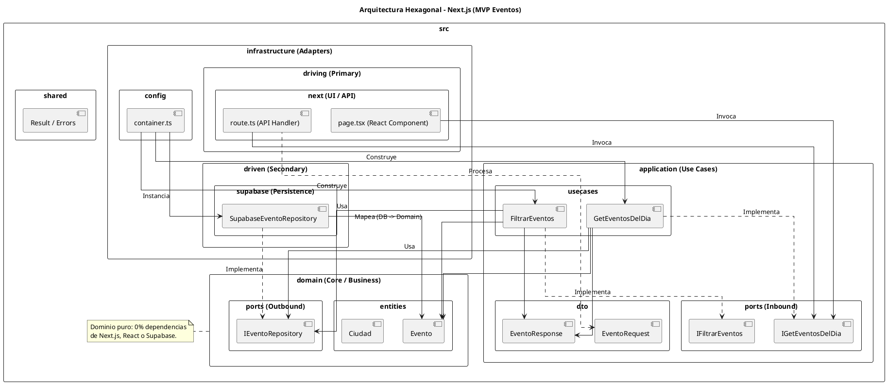

Como arquitecto de software, me parece una excelente decisión de ingeniería. Llevar **Arquitectura Hexagonal** a un entorno Full-Stack con **Next.js** te garantizará que la lógica de negocio (tu MVP de eventos) quede totalmente aislada de **Supabase** y de los componentes visuales de React. Si en el futuro decides migrar de Supabase a tu propio backend en Go o Java, el core de tu aplicación quedará intacto.

A continuación, estructuramos tu ecosistema técnico y refinamos el diagrama de paquetes resolviendo los detalles de sintaxis y acoplamiento.

---

## 💻 1. Librerías Recomendadas para el Stack

Para mantener el proyecto tipado, rápido de desarrollar (con `pnpm`) y alineado a las buenas prácticas de arquitectura limpia, utilizaremos:

* **Inyección de Dependencias:** `tsyringe` o `awilix` (opcional). Para mantener el MVP simple, podemos usar una inyección manual mediante un contenedor nativo de TypeScript (`container.ts`).
* **Validación de Datos (DTOs):** `zod` (ideal para validar las entradas de la API y los formularios).
* **Cliente de Base de Datos / Supabase:** `@supabase/supabase-js`.
* **Estilos y UI:** `Tailwind CSS` + `shadcn/ui` (para acelerar la maquetación de tarjetas, el datepicker y calendarios sin reinventar la rueda).

---

## 🛠️ 2. Automatización con CLI: Generación de Componentes y Carpetas

Dado que la estructura hexagonal requiere crear múltiples archivos por módulo (entidad, puerto, caso de uso, repositorio, adaptador driving), la mejor herramienta para automatizar esto mediante un CLI es **Plop.js**.

1. Instálalo en tu proyecto: `pnpm add -D plop`
2. Creas un archivo `plopfile.js` en la raíz. Con un solo comando como `pnpm run generate:modulo`, el CLI te preguntará el nombre del módulo (ej: *eventos*) y creará automáticamente toda la estructura de carpetas (`domain`, `application`, `infrastructure`) con plantillas base.

---

## 🐳 3. Ambientación Local de Supabase con Docker

Supabase proporciona un CLI excelente que inicializa de forma nativa todo el entorno (Auth, Postgres, Storage) dentro de contenedores Docker en tu máquina local.

Para configurarlo con `pnpm`:

```bash
# 1. Instalar el CLI de Supabase como dependencia de desarrollo
pnpm add -D supabase

# 2. Inicializar la configuración de Supabase en tu proyecto
pnpm exec supabase init

# 3. Arrancar los contenedores de Docker locales (asegúrate de tener Docker abierto)
pnpm exec supabase start

```

*Este comando descargará e iniciará las imágenes oficiales de Docker para la base de datos de tu MVP y te dará las credenciales locales de la consola de administración.*

---

## 📊 4. Diagrama de Paquetes UML (Corregido y Optimizado)

Aquí tienes el código **PlantUML** corregido, asegurando que compile sin errores de sintaxis y reflejando fielmente las dependencias de la Arquitectura Hexagonal. Las flechas apuntan estrictamente hacia adentro (la infraestructura depende de la aplicación, y la aplicación depende del dominio).



---

## 🚀 5. Despliegue en Render para Next.js con pnpm

Al desplegar una aplicación Next.js en **Render** utilizando `pnpm`, debes configurar el entorno adecuadamente en el panel de control de Render (Web Service):

1. **Build Command:** `pnpm install && pnpm build`
2. **Start Command:** `pnpm start`
3. **Variables de Entorno (Environment Variables):**
* `NEXT_PUBLIC_SUPABASE_URL`: La URL de tu proyecto de Supabase (apuntando al de producción una vez migres de Docker a la nube).
* `NEXT_PUBLIC_SUPABASE_ANON_KEY`: Tu clave pública de Supabase.


4. **Ajuste en Render:** Agrega una variable de entorno llamada `NODE_VERSION` con el valor de la versión de Node que estés usando (ej: `20.x` o `22.x`) para evitar discrepancias de entorno.

Con esta estructura, tu aplicación está lista para resistir el crecimiento del MVP con un código sumamente limpio, testeable y mantenible.