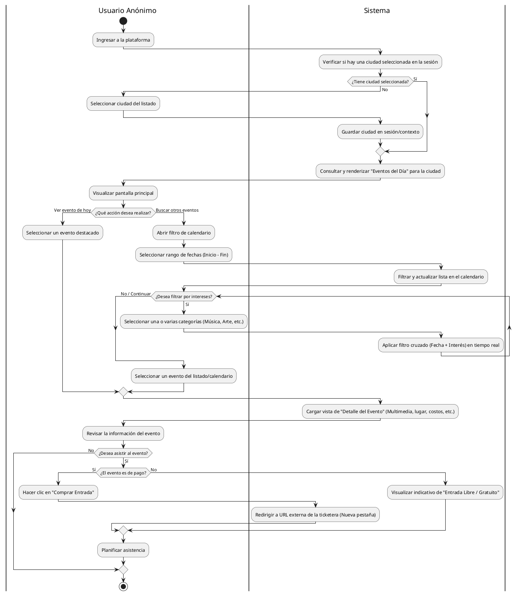

Para nuestro MVP, el flujo más crítico y que requiere mayor cuidado en la lógica es el **Descubrimiento y Consulta de Eventos**: cómo el usuario entra, filtra por fechas o intereses, y decide ver el detalle o comprar una entrada.

A continuación, te presento el diagrama estructurado en **PlantUML** utilizando las mejores prácticas (particiones o *swimlanes* para separar las responsabilidades del usuario y del sistema, nodos de decisión claros y flujos alternativos).

---

## 📊 Diagrama de Actividades: Flujo de Descubrimiento y Conversión (MVP)

---

## 💡 Buenas Prácticas UML Aplicadas

1. **Uso de Particiones (*Swimlanes*):** Dividimos el diagrama en dos columnas claras (`|Usuario Anónimo|` y `|Sistema|`). Esto ayuda al equipo de desarrollo a identificar inmediatamente qué es una acción de la interfaz de usuario (Frontend) y qué es lógica de procesamiento (Backend/Lógica de la App).
2. **Ciclos Claros (`while`):** El filtrado por intereses se modela como un bucle. El usuario puede activar y desactivar etiquetas de intereses de forma iterativa hasta encontrar lo que busca sin romper el flujo.
3. **Nodos de Decisión Explícitos:** Cada bifurcación (`if`) evalúa una condición lógica de negocio real del MVP (ej: si el evento es pago o gratuito, o si el usuario ya tiene una ciudad preconfigurada para ahorrarle pasos).

---

## 🚀 Siguiente Paso en el Roadmap

Con el alcance cerrado (Casos de Uso) y el flujo de navegación diseñado (Actividades), el comportamiento del MVP está totalmente blindado.

El paso lógico y final en nuestra fase de diseño mínimo viable es el **Diagrama de Clases (Modelo de Dominio)**. Aquí definiremos la estructura de los datos: qué atributos tendrá la entidad `Evento`, cómo se almacena la `Ciudad`, cómo se vinculan los `Intereses` y cómo estructuraremos la multimedia (imágenes/videos) sin penalizar el rendimiento.
