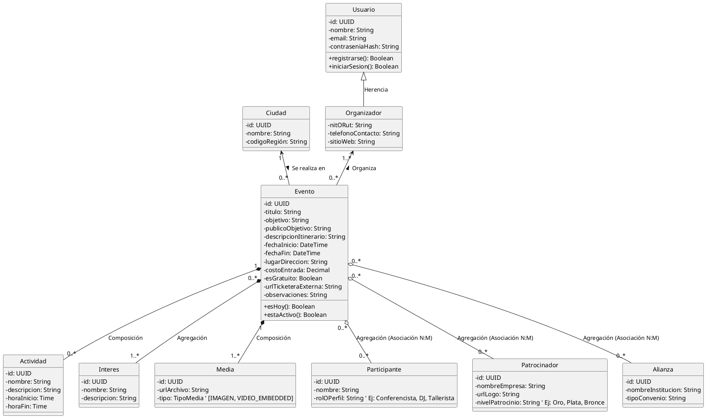

A continuación, te presento el diseño del modelo de dominio en **PlantUML** utilizando estándares profesionales.

---

## 📊 Diagrama de Clases de Dominio (MVP)

---

## 💡 Buenas Prácticas UML y Decisiones de Arquitectura Aplicadas

1. **Herencia de Actores (`<|--`):** La clase `Organizador` hereda de `Usuario`. Esto significa que un Organizador tiene inherentemente `nombre`, `email` y `contraseniaHash`, pero añade atributos específicos de negocio (como datos de contacto o registro fiscal).
2. **Composición vs. Agregación:** * **Composición (`*--`):** Las `Actividades` y la `Media` (imágenes/videos) pertenecen con exclusividad a un evento. Si el `Evento` se elimina, sus actividades y sus archivos multimedia asociados se destruyen con él.
* **Agregación (`o--`):** Los `Participantes`, `Patrocinadores`, `Alianzas` e `Intereses` usan agregación. Pueden existir independientemente de un evento específico (un mismo patrocinador o conferencista puede participar en múltiples eventos a lo largo del año).

3. **Encapsulamiento y Visibilidad:** Se utiliza el modificador `-` para atributos privados y `+` para métodos públicos. Los tipos de datos (`UUID`, `DateTime`, `Decimal`) están pensados para facilitar la traducción directa a código (TypeScript, Java, Go, etc.) y a la capa de persistencia (SQL/NoSQL).

---

## 🏁 Cierre de la Fase de Diseño del MVP

Con este Diagrama de Clases, hemos completado con éxito el blueprint técnico mínimo viable para tu producto de agendamiento de eventos:

1. **Historias de Usuario:** Definieron el *qué* y el valor de negocio.
2. **Casos de Uso:** Delimitaron el alcance y las fronteras de los roles.
3. **Diagrama de Actividades:** Trazó el flujo de navegación y la lógica de filtros.
4. **Diagrama de Clases:** Estructuró los datos, entidades y reglas de herencia/asociación.

¡Tienes el set arquitectónico listo para que el equipo de desarrollo empiece a construir el software con total claridad y sin ambigüedades!